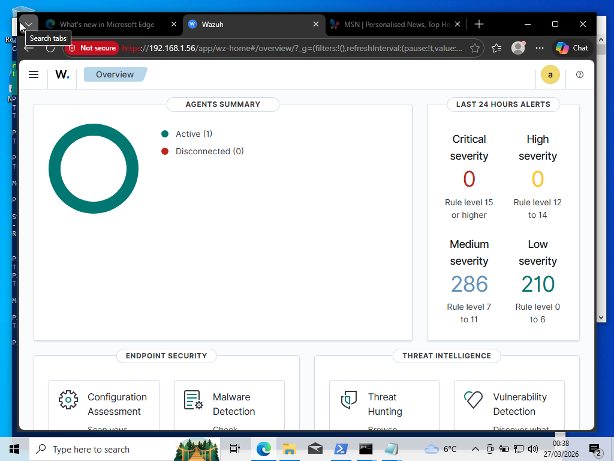
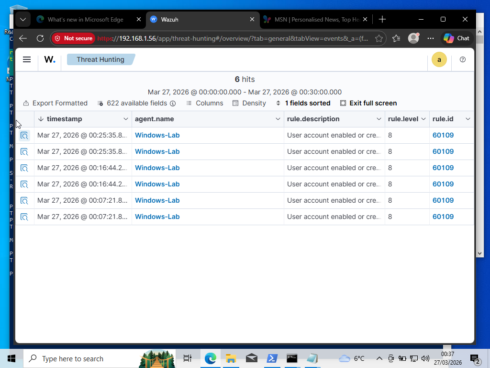
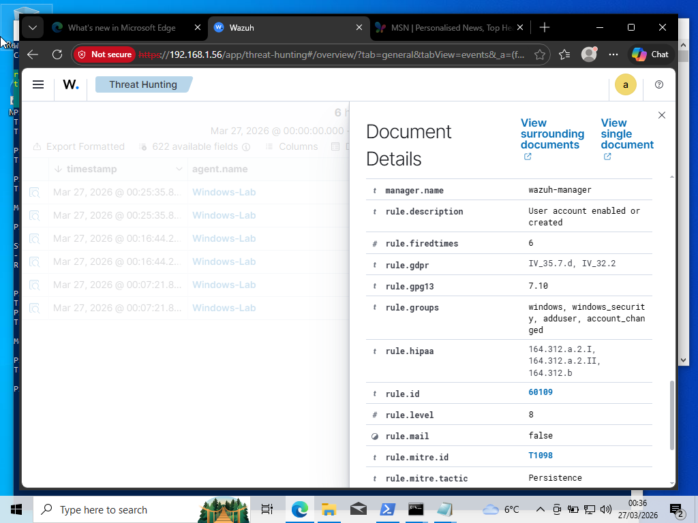

# 🛡️ SOC Automation & Threat Detection Lab (Wazuh SIEM)

## 📌 Project Overview
Built a functional Security Operations Center (SOC) environment to monitor Windows telemetry for adversary tactics using **Wazuh** SIEM/EDR. Deployed the Manager on **Ubuntu 24.04** and configured **Windows 10/11** endpoints via PowerShell. Utilized **Bridged Adapters** and **Promiscuous Mode** for Layer 2 connectivity and resolved **NTP clock skew** to ensure accurate forensic timestamping.

## 🕵️ Threat Detection Case Study: Persistence (T1136)
Simulated a **Persistence** attack by creating unauthorized local accounts to validate the detection pipeline. 

### 🛠️ Implementation Steps:
1. **Telemetry Tuning:** Enabled 'User Account Management' auditing via `auditpol` to ensure Event ID 4720 (User Creation) was captured.
2. **Attack Simulation:** Executed `net user SOC_Analyst Password123! /add` in an elevated terminal to simulate administrative persistence.
3. **Forensic Analysis:** Verified real-time ingestion of high-severity **Rule 60109** (User account added) within the SIEM, mapped to **MITRE ATT&CK T1136.001**.

---

## 📊 Evidence & Forensic Analysis

### 🟢 1. Agent Connectivity (The "Heartbeat")

*Proves the Windows endpoint is successfully communicating with the Ubuntu Manager.*

### 🟠 2. Security Events List (The "Alert Feed")

*Shows the SIEM capturing multiple high-priority alerts for unauthorized user creation.*

### 🔴 3. MITRE ATT&CK Mapping (The "Forensics")

*Deep dive into the telemetry, specifically mapping the event to MITRE Technique T1136.001.*

---

## 🚀 Key Takeaways
- Mastered the deployment of EDR agents across a virtualized network.
- Gained hands-on experience with Windows Event ID 4720 and SIEM rule logic.
- Troubleshot ingestion delays and time synchronization issues in a multi-VM environment.

